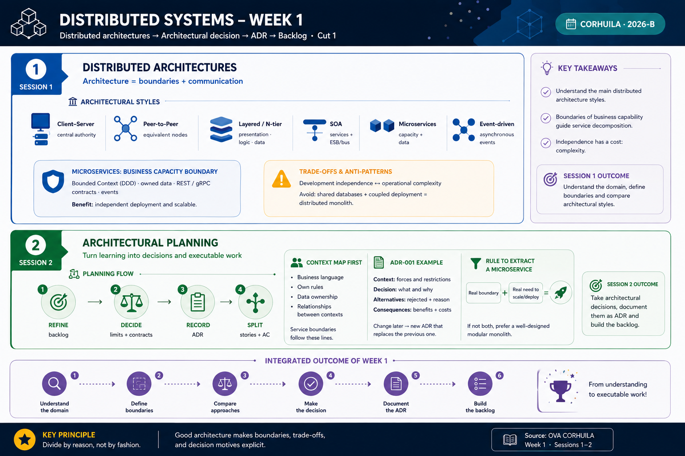

<!-- HU-STATUS TEMPLATE - do NOT remove the <!-- ... --> markers or the table headers.
     Your weekly grade is read AUTOMATICALLY from this file:
       01-week/hu-status/README.md  (inside YOUR fork). English. -->

# Weekly Status - Week 01

<!-- CONFIG-START - must match your profile repo (username/username) CONFIG -->
- FULL_NAME: Oscar Guillermo Sierra Lozano
- GITHUB_USER: Oscarsl10
- TEAM: CineSync Platform
- SPRINT_GOAL: Define and structure the Auth & User Service, establishing the business rules for user registration, JWT authentication, role management (Client, Admin), and token revocation using Go, PostgreSQL, and Redis.
<!-- CONFIG-END -->

## 1. User stories worked this week

| HU ID        | Title                                                               | Status (todo/doing/done) | Evidence (PR or commit URL) |
| ------------ | ------------------------------------------------------------------- | ------------------------ | --------------------------- |
| HU-AUTH-001  | Register a new user with BCrypt password hashing                    | doing                    | Pending implementation      |
| HU-AUTH-002  | Authenticate user and issue signed JWT access tokens                | doing                    | Pending implementation      |
| HU-AUTH-003  | Retrieve and update current user profile information                 | todo                     | Pending implementation      |
| HU-AUTH-004  | Validate JWT token claims and role-based access permissions          | doing                    | Pending implementation      |
| HU-AUTH-005  | Invalidate active JWT tokens on logout using a Redis blacklist       | todo                     | Pending implementation      |

## 2. My individual contribution

* Defined the scope of the **Auth & User Service** (`PRJ-CINE-AUTH-V01`), acting as the single source of truth for user management, credentials, and access tokens across the architecture.
* Established **Go** as the backend framework for high performance and low resource consumption.
* Selected **PostgreSQL** as the persistent relational database for storing user accounts, credentials, and role definitions.
* Integrated **Redis** as an in-memory cache to maintain a JWT revocation blacklist and manage user active session states.
* Defined the core security mechanisms: **BCrypt** for secure password hashing and **JSON Web Tokens (JWT)** carrying payload attributes (`user_id`, `email`, `role`).
* Defined the main REST API endpoints:
  * `POST /api/v1/auth/register`
  * `POST /api/v1/auth/login`
  * `GET /api/v1/users/me`
  * `PUT /api/v1/users/me`
* Established Role-Based Access Control (RBAC) rules differentiating `Cliente`, `Admin`, and `Personal de Taquilla`.
* Designed token validation middleware for external services (Catalog, Booking, Notification) to verify authenticity and extract user context.
* Structured the microservice applying **DDD, TDD, SDD, SOLID, Clean Code, and Hexagonal Architecture**, isolating the core domain logic from PostgreSQL, Redis, and HTTP drivers.
* Documented standard error responses for authentication failures, invalid credentials, duplicate email registration, and unauthorized access.

## 3. Blockers and risks

* Needs team alignment on JWT expiration time (e.g., 15-30 minutes) and whether a Refresh Token pattern will be implemented in Sprint 1.
* The API Gateway design needs to be finalized to decide whether token validation occurs at the gateway level or via inter-service middleware.
* Public/Private key distribution mechanism for JWT signature verification across downstream services needs to be agreed upon.
* Email confirmation strategy for new registrations is currently an open question and may impact the user onboarding flow.

## 4. Plan for next week

* Define detailed acceptance criteria and user stories for registration, login, and token validation.
* Initialize the repository structure for **Auth & User Service** using Hexagonal Architecture in Go.
* Implement the domain entity models (`User`, `Role`, `TokenClaims`).
* Write unit tests using TDD for password hashing and JWT issuance logic.
* Implement PostgreSQL migration scripts for `users` and `roles` tables.
* Develop HTTP handlers and middleware for JWT authentication and RBAC authorization.
* Integrate Redis client for managing token revocation on logout.
* Document endpoints using Swagger/OpenAPI specifications.
* Create the Dockerfile and local environment setup with `docker-compose`.

## 5. Compliance self-check

* [ ] Conventional Commits - `type(scope): summary`
* [ ] Per-environment HU branch + PR to that environment (`hu-xxx-dev -> develop`, ...)
* [x] Testable acceptance criteria defined at the design level
* [ ] Tests added/updated (unit / integration)
* [x] DDD / hexagonal boundaries respected (domain has no I/O)
* [x] No secrets; configuration via environment variables

### Notes

* User stories are currently in the initial design and specification phase; several stories are marked as `doing` or `todo`.
* Clean architecture ensures domain entities have zero dependencies on Go frameworks, GORM, PostgreSQL, or Redis drivers.
* Tests will be authored alongside use cases following TDD methodology.
* Repository links and pull requests will be attached as implementation commits are created.

## 6. Evidence links

* **Auth & User Service Product Brief / PDR:** `pdr.md`
* **Week 1 distributed systems diagram:** `week1_distributed_systems_diagram.png` 

