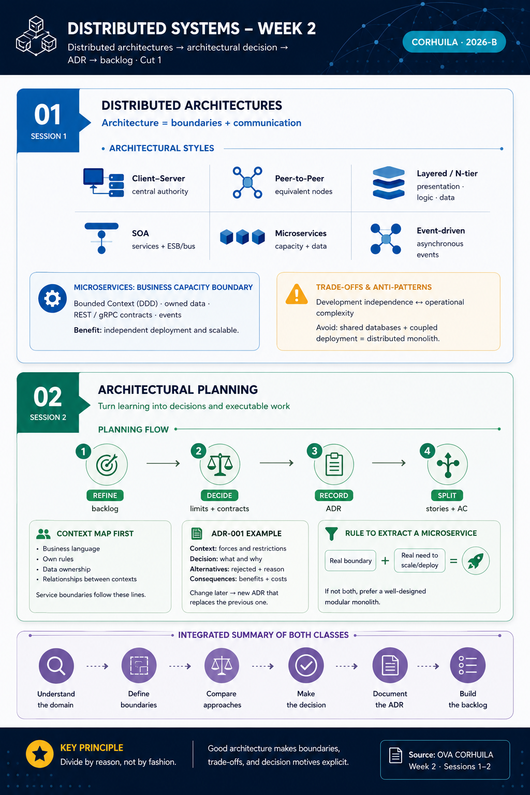
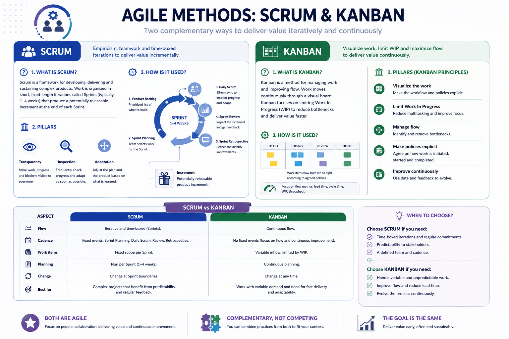

<!-- HU-STATUS TEMPLATE - do NOT remove the <!-- ... --> markers or the table headers.
     Your weekly grade is read AUTOMATICALLY from this file:
       02-week/hu-status/README.md  (inside YOUR fork). English. -->

# Weekly Status - Week 02

<!-- CONFIG-START - must match your profile repo (username/username) CONFIG -->
- FULL_NAME: Oscar Guillermo Sierra Lozano
- GITHUB_USER: Oscarsl10
- TEAM: CineSync Platform
- SPRINT_GOAL: Summary of sessions 1 and 2 of week 2 - Agile methodologies Scrum and Kanban.
<!-- CONFIG-END -->

## 1. User stories worked this week
| HU ID | Title | Status (todo/doing/done) | Evidence (PR or commit URL) |
|---|---|---|---|
| HU-002-001 | Weekly summary of Scrum and Kanban concepts | done | N/A |
| HU-002-002 | GitHub Projects board setup for the team | doing | N/A |

## 2. My individual contribution
- I reviewed the week 2 class material and summarized the main ideas of Scrum and Kanban.
- I identified the board structure we need to create in GitHub Projects for the team workflow.
- I organized the weekly deliverable content in this status file.

## 3. Blockers and risks
- The GitHub Projects board is still pending, so the workflow is not fully visible yet.
- There is no PR or commit link to attach as evidence for this week yet.

## 4. Plan for next week
- Create the team GitHub Projects board and define its columns.
- Add the tasks for the sprint and link them to the corresponding issues or user stories.
- Keep updating the weekly summary with the progress from the board.

## 5. Compliance self-check
- [ ] Conventional Commits - `type(scope): summary`
- [ ] Per-environment HU branch + PR to that environment (hu-xxx-dev -> develop, ...)
- [ ] Testable acceptance criteria
- [ ] Tests added/updated (unit / integration)
- [ ] DDD / hexagonal boundaries respected (domain has no I/O)
- [ ] No secrets; config via environment variables

## 6. Evidence links
- Week 2 summary session 1-2:

  

- Scrum and Kanban diagram:

  
