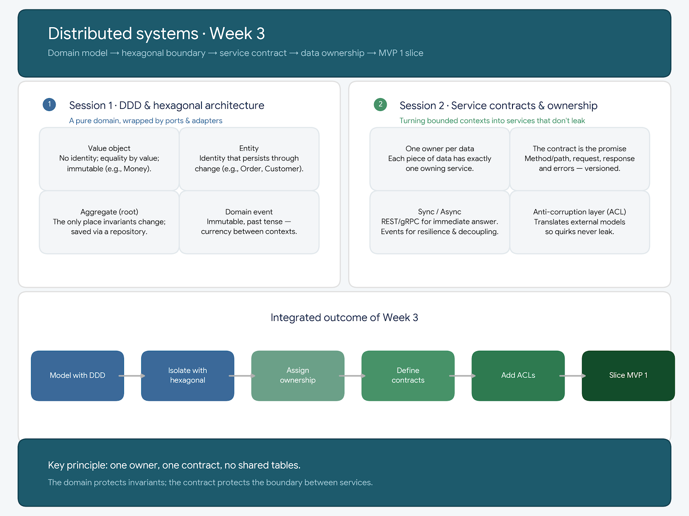

<!-- HU-STATUS TEMPLATE - do NOT remove the <!-- ... --> markers or the table headers.
     Your weekly grade is read AUTOMATICALLY from this file:
       03-week/hu-status/README.md  (inside YOUR fork). English. -->

# Weekly Status - Week 03

<!-- CONFIG-START - must match your profile repo (username/username) CONFIG -->
- FULL_NAME: Oscar Guillermo Sierra Lozano
- GITHUB_USER: Oscarsl10
- TEAM: CineSync Platform
- SPRINT_GOAL: Understand the structure of the single documentation repository and participate in the Week 03 weekly.
<!-- CONFIG-END -->

## 1. User stories worked this week
| HU ID | Title | Status (todo/doing/done) | Evidence (PR or commit URL) |
|---|---|---|---|
| HU-003-001 | Documentation repository structure and Week 03 weekly | done | N/A |

## 2. My individual contribution
- I reviewed the proposed structure for the single documentation repository (`docs`) and its reading order, from governance and context through operations, training, and project control.
- I identified the purpose of the numbered folders `00` to `15`, `99-archive`, and `assets`, along with the convention of including a `README.md` in each folder.
- I participated in the Week 03 weekly and organized the activity summary in this weekly status.

## 3. Blockers and risks
- The documentation structure was presented as a template; it still needs to be adapted and completed with CineSync Platform's actual documentation.
- There is no specific PR or commit associated with this activity to link as evidence.

## 4. Plan for next week
- Define which documents CineSync Platform needs in each `docs` folder.
- Create or complete the priority context, domain, requirements, and architecture documents.
- Keep the weekly status updated with progress and evidence.

## 5. Compliance self-check
- [ ] Conventional Commits - `type(scope): summary`
- [ ] Per-environment HU branch + PR to that environment (hu-xxx-dev -> develop, ...)
- [ ] Testable acceptance criteria
- [ ] Tests added/updated (unit / integration)
- [ ] DDD / hexagonal boundaries respected (domain has no I/O)
- [ ] No secrets; config via environment variables

## 6. Evidence links

- Week 3 summary session 1-2:

  
