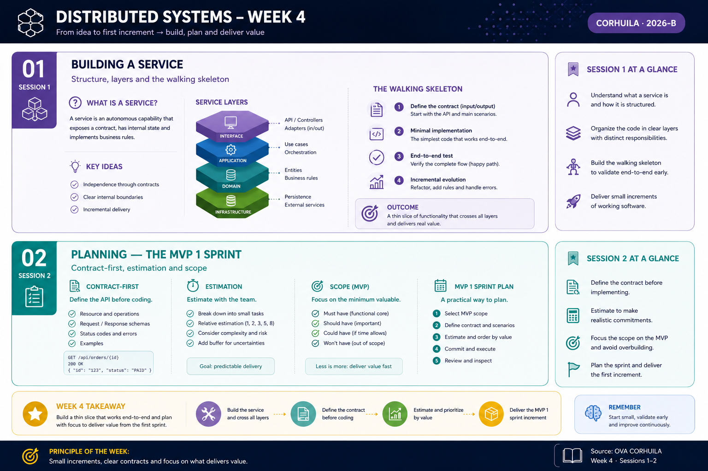

<!-- HU-STATUS TEMPLATE - do NOT remove the <!-- ... --> markers or the table headers.
     Your weekly grade is read AUTOMATICALLY from this file:
       04-week/hu-status/README.md  (inside YOUR fork). English. -->

# Weekly Status - Week 04

<!-- CONFIG-START - must match your profile repo (username/username) CONFIG -->
- FULL_NAME: Oscar Guillermo Sierra Lozano
- GITHUB_USER: Oscarsl10
- TEAM: CineSync Platform
- SPRINT_GOAL: Define and officialize initial UI/UX User Stories (HU-UI-001 & HU-UI-002), establish the backlog baseline projection for MVP backend microservices, and complete the Requirements & Traceability Matrix.
<!-- CONFIG-END -->

## 1. User stories worked this week

> **Status Clarification:** `HU-UI-001` and `HU-UI-002` are **officially completed and approved** for this iteration. Stories `HU-AUTH-*`, `HU-CATALOG-*`, `HU-BOOKING-*`, and `HU-NOTIF-*` represent the **refined backlog baseline projection** and are subject to sprint adjustments as implementation progresses.

| HU ID | Title | Status | Scope / Phase | Evidence (PR or commit URL) |
|---|---|---|---|---|
| HU-UI-001 | Definition of Design System, Branding and Visual Tokens | done | **Official Deliverable** | N/A |
| HU-UI-002 | Interactive Monolithic Mockup & GitHub Pages Deployment | done | **Official Deliverable** | N/A |
| HU-AUTH-001 | Client Registers an Account | todo (refined) | *Backlog Projection* | N/A |
| HU-AUTH-002 | User Authenticates and Receives Tokens | todo (refined) | *Backlog Projection* | N/A |
| HU-AUTH-003 | Admin Manages User Roles | todo (refined) | *Backlog Projection* | N/A |
| HU-AUTH-004 | User Changes and Verifies Email | todo (refined) | *Backlog Projection* | N/A |
| HU-AUTH-005 | Account Protection After Repeated Failed Logins | todo (refined) | *Backlog Projection* | N/A |
| HU-CATALOG-001 | Admin Publishes a Movie | todo (refined) | *Backlog Projection* | N/A |
| HU-CATALOG-002 | Admin Defines a Room and Its Seat Layout | todo (refined) | *Backlog Projection* | N/A |
| HU-CATALOG-003 | Admin Schedules a Showtime | todo (refined) | *Backlog Projection* | N/A |
| HU-CATALOG-004 | Client Browses the Billboard (UI/UX Mockup) | todo (refined) | *Backlog Projection* | N/A |
| HU-CATALOG-005 | Booking Validates Seats Against Catalog's Availability Contract | todo (refined) | *Backlog Projection* | N/A |
| HU-BOOKING-001 | Client Holds Seats for a Showtime (UI/UX Mockup) | todo (refined) | *Backlog Projection* | N/A |
| HU-BOOKING-002 | Expired Hold Releases Seats | todo (refined) | *Backlog Projection* | N/A |
| HU-BOOKING-003 | Client Confirms a Reservation (Diagrams) | todo (refined) | *Backlog Projection* | N/A |
| HU-NOTIF-001 | Notification Maintains a Local Contact Projection | todo (refined) | *Backlog Projection* | N/A |
| HU-NOTIF-002 | Ticket Is Issued and Emailed After Confirmation | todo (refined) | *Backlog Projection* | N/A |
| HU-NOTIF-003 | Duplicate Event Processing Does Not Duplicate Tickets | todo (refined) | *Backlog Projection* | N/A |
| HU-NOTIF-004 | Failed Email Delivery Is Retried | todo (refined) | *Backlog Projection* | N/A |

## 2. My individual contribution
- **Backlog Projection & Definition:** Structured the remaining 14 User Stories (`HU-AUTH-*`, `HU-CATALOG-*`, `HU-BOOKING-*`, `HU-NOTIF-*`) as the refined working backlog for implementation, leaving them documented as living specifications subject to iteration.
- **Product & Requirements Formalization:** Completed `03-product` and `04-requirements`, mapping all functional and non-functional requirements to their respective stories and owners in the Traceability Matrix.

## 3. Blockers and risks
- Risk: Changes in backend implementation scope could require updating projected user stories.
- Mitigation: Managed the backlog as a living artifact in `user-stories.md`, explicitly separating Cut 1 (UI/UX & Diagrams baseline) from Cut 2 (Microservices Code implementation).

## 4. Plan for next week
- **07-api:** Specify versioned OpenAPI (REST) and AsyncAPI contracts for inter-service communication.
- **08-uml:** Construct detailed UML sequence, component, and state machine diagrams for core flows (e.g., seat holding, atomic confirmation, and notification processing).
- **09-microservices:** Define service specifications, hexagonal layer boundaries, and internal port/adapter structures for each API component (`auth`, `catalog`, `booking`, `notification`).
- **10-devops:** Establish local development environments, `docker-compose` orchestration, CI/CD pipeline structures, and infrastructure configuration scripts.

## 5. Compliance self-check
- [x] Conventional Commits - `type(scope): summary`
- [ ] Per-environment HU branch + PR to that environment (hu-xxx-dev -> develop, ...)
- [x] Testable acceptance criteria
- [ ] Tests added/updated (unit / integration)
- [x] DDD / hexagonal boundaries respected (domain has no I/O)
- [ ] No secrets; config via environment variables

## 6. Evidence links
- Documentation Repository: https://github.com/code-corhuila/csp-docs.git

- Week 4 summary session 1-2:

  