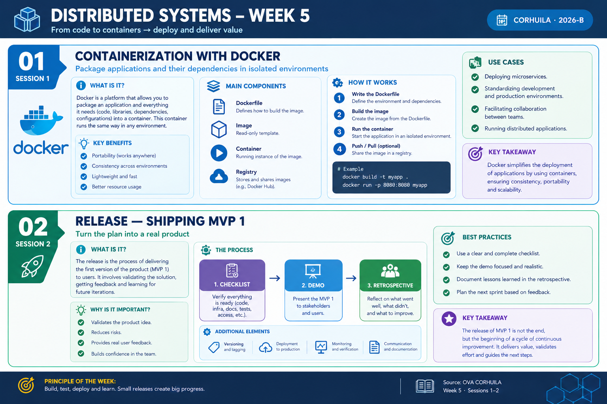

<!-- HU-STATUS TEMPLATE - do NOT remove the <!-- ... --> markers or the table headers.
     Your weekly grade is read AUTOMATICALLY from this file:
       05-week/hu-status/README.md  (inside YOUR fork). English. -->

# Weekly Status - Week 05

<!-- CONFIG-START - must match your profile repo (username/username) CONFIG -->
- FULL_NAME: Oscar Guillermo Sierra Lozano
- GITHUB_USER: Oscarsl10
- TEAM: CineSync Platform
- SPRINT_GOAL: Project the documentation work for folders 07 to 10 and complete the API documentation for the CineSync Platform.
<!-- CONFIG-END -->

## 1. User stories worked this week
| HU ID | Title | Status (todo/doing/done) | Evidence (PR or commit URL) |
|---|---|---|---|
| HU-005-001 | API documentation and contracts (`07-api`) | done | N/A |
| HU-005-002 | UML diagrams (`08-uml`) | done | N/A |
| HU-005-003 | Microservices documentation (`09-microservices`) | done | N/A |
| HU-005-004 | DevOps documentation (`10-devops`) | done | N/A |

## 2. My individual contribution
- I completed the documentation work for folder `07-api`.
- I defined the API guidelines, including versioning, authentication, and communication standards.
- I prepared the required API support structure: versioned OpenAPI contracts for REST APIs, AsyncAPI contracts for inter-service communication, and the `contracts/openapi` location as the source for API specifications and rendering.
- My teammates completed the documentation work for folders `08-uml`, `09-microservices`, and `10-devops`.

## 3. Blockers and risks
- The documentation folders are currently a projected structure and must remain synchronized with the implementation as the microservices are developed.
- API contracts may require updates when service boundaries, endpoints, events, or authentication rules change.
- No specific PR or commit links are available for this weekly activity yet.

## 4. Plan for next week
- Review the API contracts with the UML, microservices, and DevOps documentation.
- Validate that REST endpoints and asynchronous events have consistent names, payloads, authentication rules, and versioning.
- Continue updating the documentation repository with implementation evidence and links to the corresponding work.
- Present and defend the interactive mockup for Release 1.

## 5. Compliance self-check
- [x] Conventional Commits - `type(scope): summary`
- [ ] Per-environment HU branch + PR to that environment (hu-xxx-dev -> develop, ...)
- [ ] Testable acceptance criteria
- [ ] Tests added/updated (unit / integration)
- [ ] DDD / hexagonal boundaries respected (domain has no I/O)
- [ ] No secrets; config via environment variables

## 6. Evidence links
- Documentation Repository: https://github.com/code-corhuila/csp-docs.git

- `07-api` support prepared this week:
  - API guidelines and versioning rules.
  - Authentication and authorization guidance.
  - Versioned OpenAPI contracts for REST APIs.
  - AsyncAPI contracts for inter-service communication.
  - `contracts/openapi` as the source location for API specifications.

- Week 5 summary session 1-2:

  
