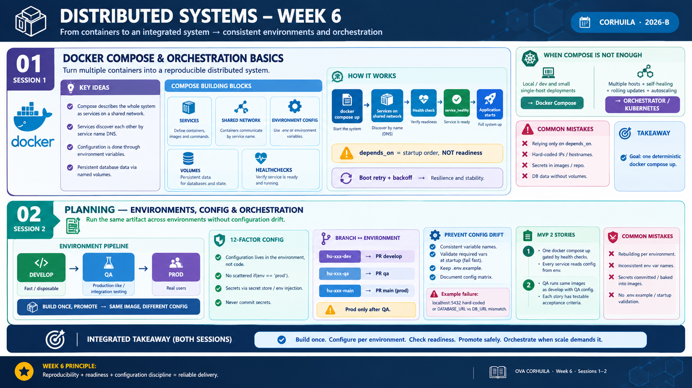

<!-- HU-STATUS TEMPLATE - do NOT remove the <!-- ... --> markers or the table headers.
     Your weekly grade is read AUTOMATICALLY from this file:
       06-week/hu-status/README.md  (inside YOUR fork). English. -->

# Weekly Status - Week 06

<!-- CONFIG-START - must match your profile repo (username/username) CONFIG -->
- FULL_NAME: Oscar Guillermo Sierra Lozano
- GITHUB_USER: Oscarsl10
- TEAM: CineSync Platform
- SPRINT_GOAL: Conduct the presentation and defense of the interactive mockup for Cut 1 (Release 1) and validate alignment across documentation, UI/UX design, and architectural contracts.
<!-- CONFIG-END -->

## 1. User stories worked this week
| HU ID | Title | Status (todo/doing/done) | Evidence (PR or commit URL) |
|---|---|---|---|
| HU-006-001 | Mockup defense and presentation for Cut 1 | done | N/A |
| HU-006-002 | Review and cross-validation of UI/UX flows with OpenAPI contracts | done | N/A |

## 2. My individual contribution
- Prepared and presented the architectural rationale and user workflow during the Cut 1 interactive mockup defense.
- Demonstrated how the user interface flows map directly to the domain events and REST/AsyncAPI endpoints defined in the project contracts.
- Collected feedback from the presentation to refine UI interactions and backend interface integration for upcoming implementation sprints.

## 3. Blockers and risks
- Transitioning from mockup validation to microservices development requires strictly synchronizing frontend expectations with API contract schemas.
- Changes resulting from presentation feedback must be reflected across domain models and technical documentation before active coding begins.

## 4. Plan for next week
- Incorporate adjustments identified during the Cut 1 presentation into the domain contracts and documentation.
- Begin setup for initial microservice boilerplate code adhering to Hexagonal Architecture and DDD boundaries.
- Define development branches and task assignments for backend and frontend implementation.

## 5. Compliance self-check
- [x] Conventional Commits - `type(scope): summary`
- [ ] Per-environment HU branch + PR to that environment (hu-xxx-dev -> develop, ...)
- [ ] Testable acceptance criteria
- [ ] Tests added/updated (unit / integration)
- [x] DDD / hexagonal boundaries respected (domain has no I/O)
- [x] No secrets; config via environment variables

## 6. Evidence links
- Documentation Repository: https://github.com/code-corhuila/csp-docs.git
- Interactive Mockup & Presentation Material:
  - Mockup presentation and defense for Cut 1 (Release 1).

- Week 6 summary session 1-2:

  