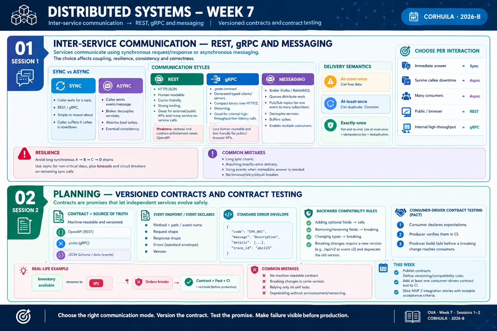

<!-- HU-STATUS TEMPLATE - do NOT remove the <!-- ... --> markers or the table headers.
     Your weekly grade is read AUTOMATICALLY from this file:
       07-week/hu-status/README.md  (inside YOUR fork). English. -->

# Weekly Status - Week 07

<!-- CONFIG-START - must match your profile repo (username/username) CONFIG -->
- FULL_NAME: Oscar Guillermo Sierra Lozano
- GITHUB_USER: Oscarsl10
- TEAM: CineSync Platform
- SPRINT_GOAL: Consolidate and validate the CineSync architecture and documentation by aligning ADR traceability, UX/UI flows, domain boundaries, service naming and DevOps branch conventions with HU-ARCH-001, ensuring the documentation is ready for review and submission through a Pull Request to main.
<!-- CONFIG-END -->

## 1. User stories worked this week
| HU ID | Title | Status (todo/doing/done) | Evidence (PR or commit URL) |
|---|---|---|---|
| HU-ARCH-001 | CineSync Architecture and Domain Diagrams | doing | [9471dfa](https://github.com/code-corhuila/csp-docs/commit/9471dfa), [78f0369](https://github.com/code-corhuila/csp-docs/commit/78f0369) |
| HU-UI-001 | Definition of Design System, Branding and Visual Tokens | done | [358117d](https://github.com/code-corhuila/csp-docs/commit/358117d) |
| HU-UI-002 | Interactive Monolithic Mockup and GitHub Pages Deployment | done | [358117d](https://github.com/code-corhuila/csp-docs/commit/358117d) |

## 2. My individual contribution

- Updated architecture documentation and ADR traceability for `HU-ARCH-001`.
- Documented the separation between the former Notification & Ticket Service and Ticketing & Fulfillment in ADR-005.
- Updated UX/UI documentation for optional snack selection, reservation expiration, ticket and receipt concession rendering, and error-token behavior.
- Corrected DevOps documentation to use the governed `feat/*`, `fix/*` and `chore/*` branch conventions.
- Learned and applied the new workflow for sending changes to `main`: create a child branch, commit using Conventional Commits, push the branch, and open a Pull Request to `main`.

## 3. Blockers and risks

- ADR-002 is an historical record and must not be rewritten. Later architectural changes must be documented in new ADRs.
- ADR-005 requires consistent status and traceability alignment with the ADR register.
- This week's work was documentation-only; no application unit or integration tests were added.
- The documentation PR still requires review and approval before it can be merged into `main`.

## 4. Plan for next week

- Finalize the ADR traceability corrections and open or update the Pull Request to `main`.
- Validate Markdown formatting, internal links, ADR references and naming conventions.
- Review the remaining architecture and UX/UI documentation against `HU-ARCH-001`.
- Continue using child branches and Pull Requests for all changes to `main`.

## 5. Compliance self-check

- [x] Conventional Commits - `type(scope): summary`
- [ ] Per-environment HU branch + PR to that environment (`hu-xxx-dev -> develop`, ...). Not applicable to this documentation repository; it uses `docs/* -> main`.
- [x] Testable acceptance criteria
- [ ] Tests added/updated (unit / integration). Not applicable; this week's changes were documentation-only.
- [x] DDD / hexagonal boundaries respected (domain has no I/O)
- [x] No secrets; config via environment variables

## 6. Evidence links

- [Branch used: `docs/update-ux-ui`](https://github.com/code-corhuila/csp-docs/tree/docs/update-ux-ui)
- [Architecture ADR update](https://github.com/code-corhuila/csp-docs/commit/9471dfa)
- [Architecture and domain traceability update](https://github.com/code-corhuila/csp-docs/commit/78f0369)
- [UX/UI documentation update](https://github.com/code-corhuila/csp-docs/commit/358117d)
- [DevOps branch convention update](https://github.com/code-corhuila/csp-docs/commit/9a1acb6)
- [UX/UI and DevOps alignment update](https://github.com/code-corhuila/csp-docs/commit/b8b3281)

- Week 7 summary session 1-2:

  