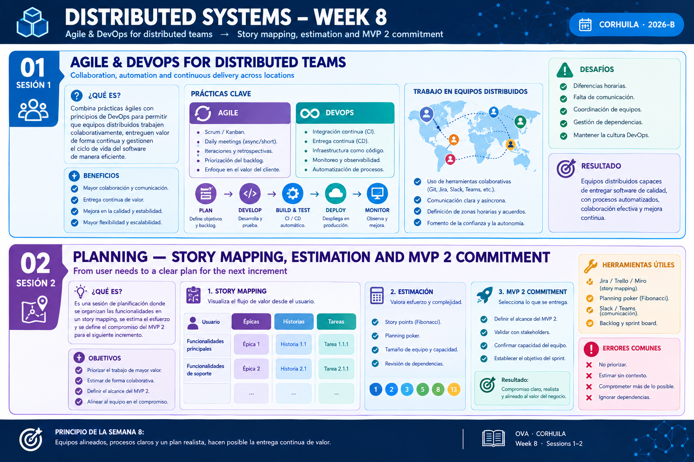

<!-- HU-STATUS TEMPLATE - do NOT remove the <!-- ... --> markers or the table headers.
     Your weekly grade is read AUTOMATICALLY from this file:
       08-week/hu-status/README.md  (inside YOUR fork). English. -->

# Weekly Status - Week 08

<!-- CONFIG-START - must match your profile repo (username/username) CONFIG -->
- FULL_NAME: Oscar Guillermo Sierra Lozano
- GITHUB_USER: Oscarsl10
- TEAM: CineSync Platform
- SPRINT_GOAL: Formulate, review, and standardize Architecture Decision Records (ADR-007 through ADR-010) to establish messaging fault tolerance, concessions domain boundaries, diagram source standards, and UML traceability for the CineSync platform.
<!-- CONFIG-END -->

## 1. User stories worked this week
| HU ID | Title | Status (todo/doing/done) | Evidence (PR or commit URL) |
|---|---|---|---|
| HU-ARCH-001 | CineSync Architecture and Domain Diagrams | doing | [csp-docs](https://github.com/code-corhuila/csp-docs) |

## 2. My individual contribution

- Authored and proposed **ADR-007: AMQP Consumer Fault Tolerance and Dead-Letter Exchange (DLX) Strategy**.
- Participated in the review and discussion of **ADR-008: Concessions Contract and Inventory Boundary** proposed by team members.
- Co-created and approved **ADR-009: Diagram Source Format Standard for C4 and Behavioral Views**.
- Authored and proposed **ADR-010: Microservices Boundaries and UML Traceability**.
- Updated general architecture and domain documentation across the repository to maintain consistency with new ADRs.

## 3. Blockers and risks

- ADR proposals (ADR-007 and ADR-010) require formal team consensus and approval prior to final integration into the main architecture baseline.
- Ensuring strict consistency between C4 diagram source files and UML traceability matrices across all microservice boundaries.
- Work this week was focused on architectural decisions and documentation; no code implementations or unit tests were added.

## 4. Plan for next week

- Finalize peer reviews and merge approved ADRs (ADR-007, ADR-008, ADR-010) into `main`.
- Align C4 diagrams and behavioral views with the new standard defined in ADR-009.
- Continue refining microservice domain boundaries and prepare initial technical specifications for execution.

## 5. Compliance self-check

- [x] Conventional Commits - `type(scope): summary`
- [ ] Per-environment HU branch + PR to that environment (`hu-xxx-dev -> develop`, ...). Not applicable to this documentation repository; it uses `docs/* -> main`.
- [x] Testable acceptance criteria
- [ ] Tests added/updated (unit / integration). Not applicable; this week's changes were documentation-only.
- [x] DDD / hexagonal boundaries respected (domain has no I/O)
- [x] No secrets; config via environment variables

## 6. Evidence links

- [Week 07 - 08 Full Commit Log csp-docs](/08-week/hu-status/commits.md)
- [Repository: csp-docs](https://github.com/code-corhuila/csp-docs)
- [ADR-007 Proposal: AMQP Consumer Fault Tolerance and DLX Strategy](https://github.com/code-corhuila/csp-docs)
- [ADR-009 Standard: Diagram Source Format for C4 and Behavioral Views](https://github.com/code-corhuila/csp-docs)
- [ADR-010 Proposal: Microservices Boundaries and UML Traceability](https://github.com/code-corhuila/csp-docs)
- Week 8 summary session 1-2:

  