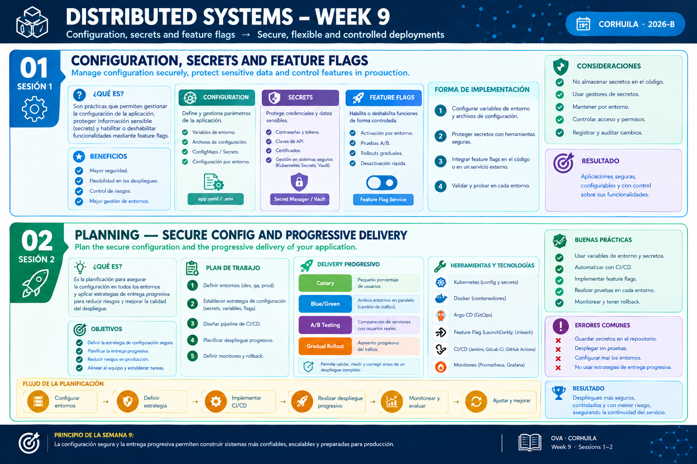

<!-- HU-STATUS TEMPLATE - do NOT remove the <!-- ... --> markers or the table headers.
     Your weekly grade is read AUTOMATICALLY from this file:
       09-week/hu-status/README.md  (inside YOUR fork). English. -->

# Weekly Status - Week 09

<!-- CONFIG-START - must match your profile repo (username/username) CONFIG -->
- FULL_NAME: Oscar Guillermo Sierra Lozano
- GITHUB_USER: Oscarsl10
- TEAM: CineSync Platform
- SPRINT_GOAL: Keep the CineSync documentation aligned with the accepted ADRs, create the Concessions repositories (api, db) and the per-engine infrastructure repositories (csp-infra-postgres, csp-infra-mongo), and advance the base scaffold of the booking, auth and catalog repositories.
<!-- CONFIG-END -->

## 1. User stories worked this week
| HU ID | Title | Status (todo/doing/done) | Evidence (PR or commit URL) |
|---|---|---|---|
| HU-ARCH-001 | CineSync Architecture and Domain Diagrams | doing | [csp-docs](https://github.com/code-corhuila/csp-docs) |

## 2. My individual contribution

- Updated the documentation in `csp-docs` (170 commits, merged through `docs/* -> main` PRs): ADR-012 to ADR-014 (booking stack and outbox relay), ADR-019 to ADR-021 (outbox relay of other domains, Catalog snapshot, `qa-promote` branch prefix), the Cut 2 frontend stories (HU-FE-AUTH-001, HU-FE-TICKETING-001, HU-FE-CONCESSIONS-001), the traceability matrix, the product backlog, the API contracts (internal purge operation) and the data models (Flyway/Liquibase ownership per `-db` repository).
- Created the Concessions repositories `csp-concessions-api` and `csp-concessions-db`, seeded with the governance files (README, CODEOWNERS); `csp-concessions-portal` was seeded in the same domain.
- Created and renamed the infrastructure repositories by engine, `csp-infra-postgres` and `csp-infra-mongo`: `csp-infra-mongo` was created and aligned to the project identity, and the documentation now uses the per-engine infra names (ADR-020 scope, Catalog docs naming `csp-infra-mongo` as the Mongo instance source).
- Advanced the base structure of the domain repositories: booking (`api`, `db`, `portal`), auth (`api`, `db`, `portal`) and catalog (`api`, `db`, `portal`), with CI/deploy scaffolds, governance files, domain model, schema and runtime configuration, each through child branches and PRs to `develop`.
- Full commit log of the week: [commits.md](commits.md).

## 3. Blockers and risks

- Some repositories still carry template text (LMS Library / Grupo 2) in their README and must be aligned to CineSync Platform / Group 1 before the structure is considered complete.
- `csp-infra-postgres` and `csp-infra-mongo` have only the governance seed; their Compose/IaC, environments and secrets structure is still pending.
- The PR size cap (400 lines added + deleted) forces scaffold work to be split into several small PRs, which increases the number of merges and branch syncs.
- Functionality is not started yet: every functional PR needs its HU, contract and failing test first (SDD / TDD).

## 4. Plan for next week

- Finish the base structure of every repository (api, db, portal, infra, worker, workflow, gateway, front), including CI, governance files and README aligned to the project identity.
- Start implementing functionalities driven by user stories (HU): spec and contract first, then a failing test, then the code, with one HU declared per functional PR.
- Keep the documentation in sync with every decision through `docs/* -> main` PRs.

## 5. Compliance self-check

- [x] Conventional Commits - `type(scope): summary`
- [x] Per-environment HU branch + PR to that environment (code repos: child branch -> `develop`; `csp-docs`: `docs/* -> main`)
- [x] Testable acceptance criteria
- [x] Tests added/updated (unit / integration). Added in booking and catalog; scaffold-only repositories contain structure only.
- [x] DDD / hexagonal boundaries respected (domain has no I/O)
- [x] No secrets; config via environment variables

## 6. Evidence links

- [Week 09 Full Commit Log (docs and code repositories)](commits.md)
- [Repository: csp-docs](https://github.com/code-corhuila/csp-docs)
- [Repository: csp-concessions-api](https://github.com/code-corhuila/csp-concessions-api)
- [Repository: csp-concessions-db](https://github.com/code-corhuila/csp-concessions-db)
- [Repository: csp-infra-postgres](https://github.com/code-corhuila/csp-infra-postgres)
- [Repository: csp-infra-mongo](https://github.com/code-corhuila/csp-infra-mongo)
- [Repository: csp-booking-api](https://github.com/code-corhuila/csp-booking-api)
- [Repository: csp-auth-api](https://github.com/code-corhuila/csp-auth-api)
- [Repository: csp-catalog-api](https://github.com/code-corhuila/csp-catalog-api)
- Week 9 summary session 1-2:

  
