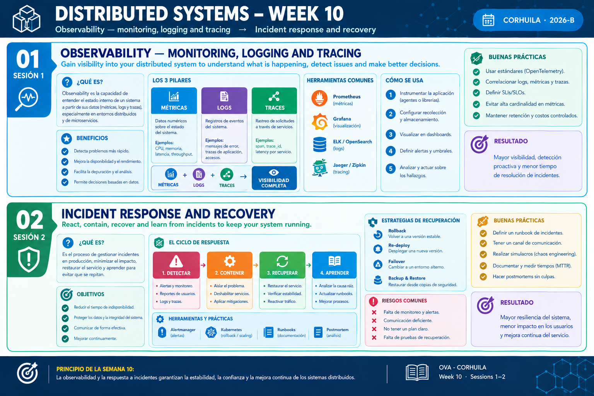

<!-- HU-STATUS TEMPLATE - do NOT remove the <!-- ... --> markers or the table headers.
     Your weekly grade is read AUTOMATICALLY from this file:
       10-week/hu-status/README.md  (inside YOUR fork). English. -->

# Weekly Status - Week 10

<!-- CONFIG-START - must match your profile repo (username/username) CONFIG -->
- FULL_NAME: Oscar Guillermo Sierra Lozano
- GITHUB_USER: Oscarsl10
- TEAM: CineSync Platform
- SPRINT_GOAL: Move from scaffold to functionality: implement registration and login in the Auth service (HU-AUTH-001, HU-AUTH-002), deliver the synthetic-data frontends of Auth and Concessions (HU-FE-AUTH-001, HU-FE-CONCESSIONS-001), build the front shell that mounts the domain portals, and record the front-end runtime decisions (ADR-025 to ADR-027).
<!-- CONFIG-END -->

## 1. User stories worked this week
| HU ID | Title | Status (todo/doing/done) | Evidence (PR or commit URL) |
|---|---|---|---|
| HU-AUTH-001 | Client Registers an Account | doing | [csp-auth-api#44](https://github.com/code-corhuila/csp-auth-api/pull/44), [csp-auth-api#45](https://github.com/code-corhuila/csp-auth-api/pull/45), [csp-auth-db#24](https://github.com/code-corhuila/csp-auth-db/pull/24) |
| HU-AUTH-002 | User Authenticates and Receives Tokens | doing | [csp-auth-api#42](https://github.com/code-corhuila/csp-auth-api/pull/42), [csp-auth-api#48](https://github.com/code-corhuila/csp-auth-api/pull/48), [csp-auth-api#49](https://github.com/code-corhuila/csp-auth-api/pull/49) |
| HU-FE-AUTH-001 | Frontend Auth Renders Synthetic Users | done | [csp-auth-portal#38](https://github.com/code-corhuila/csp-auth-portal/pull/38) |
| HU-FE-CONCESSIONS-001 | Frontend Concessions Renders Synthetic Data | done | [csp-concessions-portal#48](https://github.com/code-corhuila/csp-concessions-portal/pull/48) |
| HU-ARCH-001 | CineSync Architecture and Domain Diagrams | done | [csp-docs#99](https://github.com/code-corhuila/csp-docs/pull/99), [csp-docs#101](https://github.com/code-corhuila/csp-docs/pull/101), [csp-docs#103](https://github.com/code-corhuila/csp-docs/pull/103) |

## 2. My individual contribution

- **Auth API (HU-AUTH-001, HU-AUTH-002)**: implemented in Go with hexagonal architecture and TDD (122 commits across the repositories this week, listed in [commits.md](commits.md)). Registration: domain model (`User`, `Email`, `Role`, password policy with the 72-byte bcrypt limit), use case and ports, PostgreSQL and bcrypt adapters, `POST /register` wired in the composition root, and idempotent registration through the `Idempotency-Key`. Authentication: login use case, RS256 access token issuer with an RFC 7638 key id, the signing key published at `GET /jwks`, refresh tokens stored and issued, and `POST /login` and `POST /refresh` (rotation) in open PRs. Integration tests run in CI against the `csp-auth-db` schema.
- **Auth database**: added phone and address columns to `app_user` and the `idempotency_key` table for registration (Flyway, Annex A), grants for the outbox purge, and a CI check of the seed, roles, grants and constraints of the schema.
- **Frontends with synthetic data**: `csp-auth-portal` (login and register as modals with toasts, in-memory session and role guards, forms with phone and address, 2.0.0 changelog) and `csp-concessions-portal` (synthetic catalog, snack selection, order draft with total, administration screens for products, combos and inventory). Both ship their unit specs and a promotion path `develop` -> `qa` -> `main` (release 2.0.0 PRs open).
- **Front shell (`csp-front`)**: runtime `config.json` for the gateway URL, design tokens and layout, mounts for the catalog, snack, booking and catalog administration portals, session loader that opens protected routes with the Auth portal session, role guard, development-only token sign-in and specs for the mounts.
- **Documentation (`csp-docs`)**: ADR-024 index entry, ADR-025 (api-gateway at port 8000, front shell and remotes), ADR-026 (front-end runtime configuration, remote ports, CORS from the environment), ADR-027 (one federated entry per role in each domain portal), the register contract (phone, address, 72-byte password, `Idempotency-Key` of 8 to 128 characters, 409 codes and `Location`) and the Auth runbook (retention of idempotency keys, expired refresh tokens not purged in the MVP).
- **Infrastructure**: `csp-infra-mongo` structure with the single MongoDB instance as a single-node replica set and a CI check from an empty volume; `csp-infra-postgres` composes the MongoDB instance and the Auth service in the platform.
- **Alignment of the remotes**: dev ports of the catalog (4203), concessions (4204) and ticketing portals moved to the values of ADR-026.
- Full commit log of the week: [commits.md](commits.md).

## 3. Blockers and risks

- `POST /login` and `POST /refresh` (HU-AUTH-002) are still in review; HU-AUTH-001 and HU-AUTH-002 stay open until their remaining PRs are merged.
- The release PRs of the Auth and Concessions portals to `main` (2.0.0) wait for the review and the leader's OK.
- The purge of expired refresh tokens needs a job in `csp-worker` (norm 4.3), which is not started; it is documented as out of the MVP.
- The 400-line PR cap (norm 9.2) keeps splitting the work into many small PRs and promotion segments, which multiplies merges and syncs.
- Roles, email change, account lock and password reset (HU-AUTH-003 to HU-AUTH-006) depend on the base of HU-AUTH-001 and HU-AUTH-002 being merged first.

## 4. Plan for next week

- Present the demo of the platform: registration and login against the Auth API, the front shell mounting the Auth, Catalog, Concessions and Booking portals, and the synthetic-data screens.
- Continue with the user stories: finish HU-AUTH-001 and HU-AUTH-002, then start HU-AUTH-003 to HU-AUTH-006 following the board (spec and contract first, failing test, then the code).
- Close the open release PRs of HU-FE-AUTH-001 and HU-FE-CONCESSIONS-001 and keep the documentation in sync with every decision through `docs/* -> main` PRs.

## 5. Compliance self-check

- [x] Conventional Commits - `type(scope): summary`
- [x] Per-environment HU branch + PR to that environment (code repos: child branch -> `develop`; `csp-docs`: `docs/* -> main`)
- [x] Testable acceptance criteria
- [x] Tests added/updated (unit / integration). Unit tests for the domain and use cases of Auth, integration tests against the `csp-auth-db` schema in CI, specs for the portals and the shell.
- [x] DDD / hexagonal boundaries respected (domain has no I/O)
- [x] No secrets; config via environment variables

## 6. Evidence links

- [Week 10 Full Commit Log (docs and code repositories)](commits.md)
- [Repository: csp-docs](https://github.com/code-corhuila/csp-docs)
- [Repository: csp-auth-api](https://github.com/code-corhuila/csp-auth-api)
- [Repository: csp-auth-db](https://github.com/code-corhuila/csp-auth-db)
- [Repository: csp-auth-portal](https://github.com/code-corhuila/csp-auth-portal)
- [Repository: csp-concessions-portal](https://github.com/code-corhuila/csp-concessions-portal)
- [Repository: csp-front](https://github.com/code-corhuila/csp-front)
- [Repository: csp-infra-mongo](https://github.com/code-corhuila/csp-infra-mongo)
- [Repository: csp-infra-postgres](https://github.com/code-corhuila/csp-infra-postgres)
- Week 10 summary session 1-2:

  
